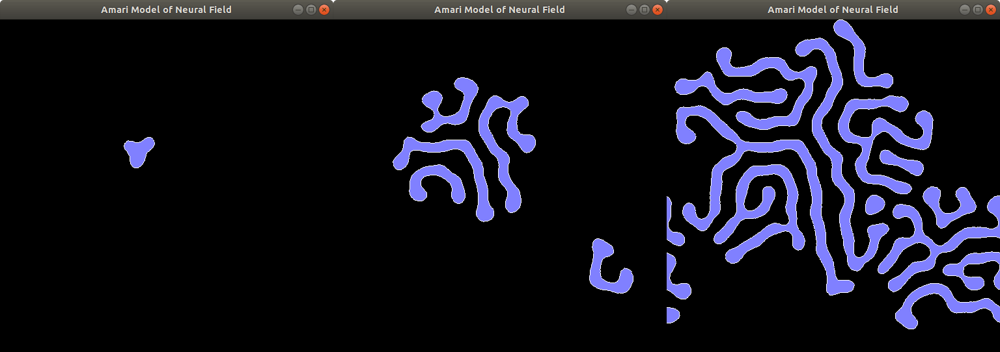
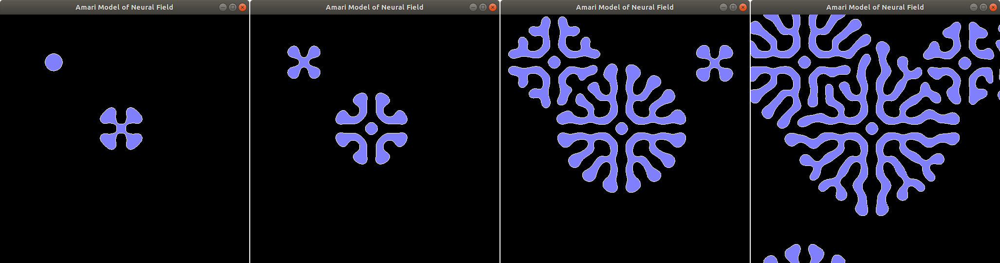
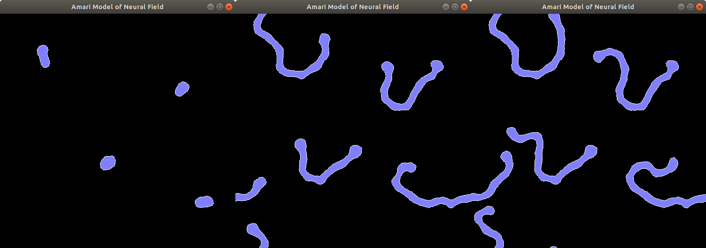

## Introduction

Neural field model describes evolution of activity rate in neurons. The dynamics
of neural activity on 2D plane is implemented using the Amari Model. Model
of excitatory and inhibitory neurons with connectivities use scalar equation
for the activity function `u(x, t)`.

Marching square algorithm is used to create vectorized ontline of the activite
neural area.



## Prerequisites

Compiling and running the sample project requires GCC, CMake, GNU Make
as well as some graphics libraries installed.

## Environment Setup

### Debian-based Systems

The following instructions are applied to these operating systems:

* Ubuntu 16.04
* Debian 9

```
sudo apt-get install -y \
    build-essential \
    cmake \
    freeglut3-dev \
    libglew-dev \
    libglm-dev \
    libfreetype6-dev
```

### RedHat-based Systems

The following instructions are applied to these operating systems:

* Fedora >=22

```
sudo dnf groupinstall -y "Development Tools"
sudo dnf install -y \
    cmake \
    freeglut-devel \
    glew-devel \
    glm-devel \
    freetype-devel
```

## Building Project

The program is built with the commands below. CMake requires the directory 
with the main project's `CMakeLists.txt` file as an argument. Then the CMake 
creates the build files for the GNU make which build an executable.

```
cd <PathToProject>
mkdir build && cd build
cmake ..
make
```

After the successful build the binary `Ocean` will end up in `build/src/Ocean/` directory.

```
cd <PathToProject>
cd build/src/AmariModel
./AmariModel
```

## Installation

In order to make the stand-alone bundle for the simulation executable and all the data files `make install`
is used.

```
cd <PathToProject>/build
make install
```

This will install all of the files required for an executable to `<PathToProject>/bundle/AmariModel` directory.

```
cd <PathToProject>/bundle
tree
.
└── AmariModel
    ├── AmariModel
    └── data
        ├── amari.conf
        ├── font.ttf
        ├── plane.frag
        └── plane.vert

2 directories, 5 files
cd AmariModel
./AmariModel
```

## Configuration

The parameters of the model can be adjusted in the `data/amari.conf` file:

```
# size = 128 | 256 | 512
size = 256

# h = 0..-0.3
h = -0.2

k = 0.05
K = 0.125
m = 0.025

# M = 0.05..0.07, 0.0625 - optimal
M = 0.065

# mode = wrap | reflect
mode = wrap
```

* `size` - Size of discrete neural field.
* `M` - Activation spread parameter. Smaller values stand for easily activated naural field,
larger values lead to smaller activity spread from the same activity initiator.
* `h` - Discrepancy parameter. Zero stands for no discrepancies and leads to symmetric model.
Smaller values lead to unsymmetric development of an activity.
* `mode` - Behavior on the neural field boundaries. `wrap` stands for the possibility of
boundary neurons to influence the opposite boundary. `reflect` stands for boundary as the line
of an active neurons.






## Controls

* `F1` - Toggle fullscreen mode.
* `F2` - Show/hide help on the screen.
* `Space` - Clear the model.
* `Left Mouse Click` - Initiate the activity in a pointunder cursor.
* `1` - Toggle textured mode.
* `2` - Toggle filled contour mode.
* `3` - Toggle outline mode.
* `B` - Toggle blurring for the textured mode.

## Links

* [https://habrahabr.ru/post/181265/](https://habrahabr.ru/post/181265/).
* Konstantin Doubrovinski, Dynamics, [Stability and Bifurcation Phenomena in the Nonlocal Model of Cortical Activity](http://citeseerx.ist.psu.edu/viewdoc/download?doi=10.1.1.64.8688&rep=rep1&type=pdf), 2005.
* Dequan Jin, Dong Liang, Jigen Peng, [Existence and Properties of Stationary Solution of Dynamical Neural Field](http://gr.xjtu.edu.cn/c/document_library/get_file?folderId=29529&name=DLFE-2974.pdf), 2011.
* Stephen Coombes, Helmut Schmidt, Ingo Bojak, [Interface Dynamics in Planar Neural Field Models](http://www.mathematical-neuroscience.com/content/2/1/9), 2012.

