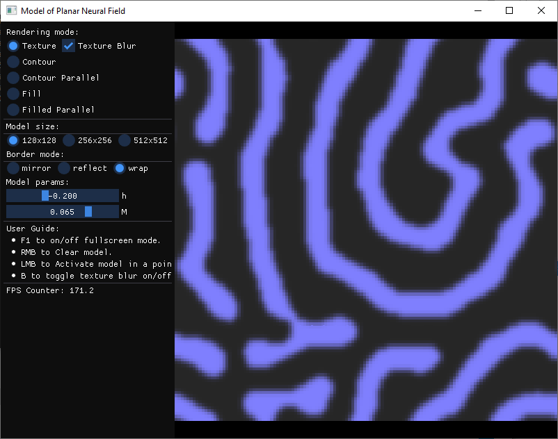
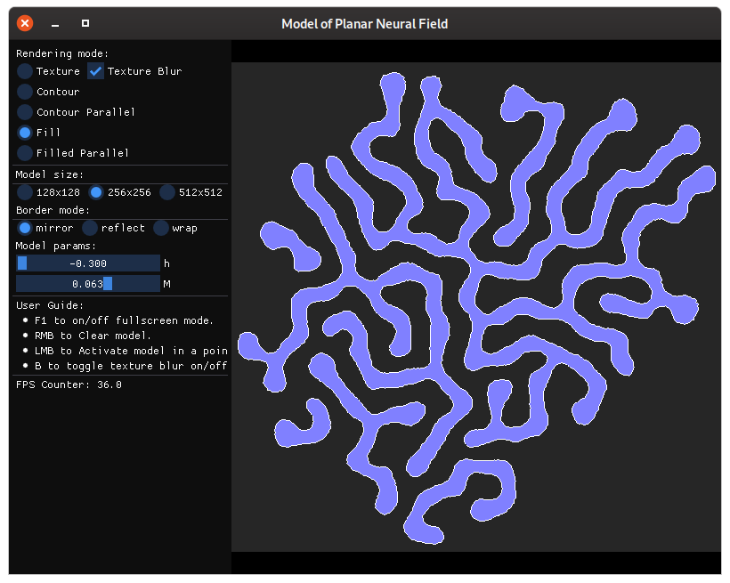
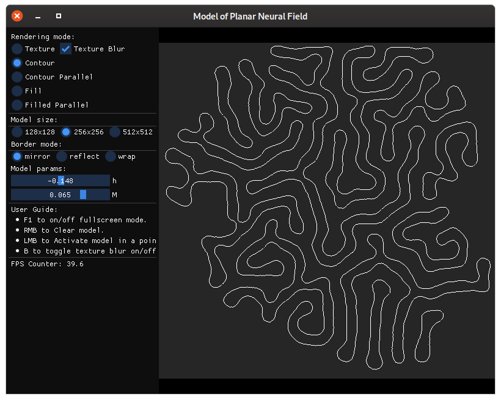
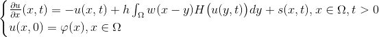
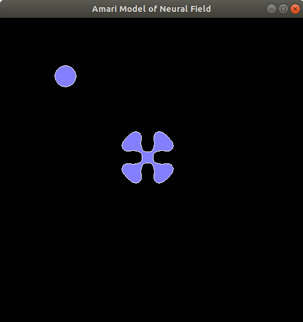
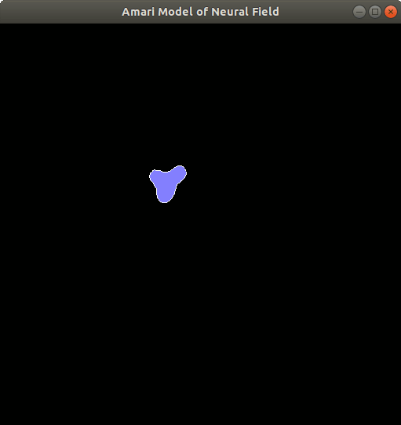
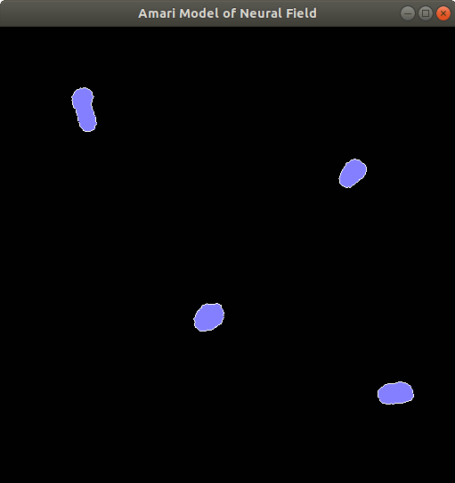

## Introduction
This is a model of a planar neural field that simulates evolution of activity rate of neurons implemented using the Amari equation.

This project is written in C++ and it uses CMake to generate platform-specific build files. Program uses OpenGL 3.3 or higher for rendering and ImGui library for the UI. Linear outlines are produced using the [Marching squares](https://en.wikipedia.org/wiki/Marching_squares) algorithm. Matrix algebra and marching squares use [OpenMP API](https://en.wikipedia.org/wiki/OpenMP) for paralleling calculations on CPU.

## Sceenshots






## Description of the Amari Neural Field
Planar neural field is modeled using an Amari model that uses the solution of the Cauchy problem for integro-differential equation:



* `u(x,t)` - activity function,
* `h` - equilibrium potential,
* `H(x)` - Heaviside function,
* `w` - weight function,
* `s` - external inhibition,
* `phi` - initial distribution of an electric potential at `t=0`,
* `x` - coordinate in the area `Omega`.

## Prerequisites
You need CMake to generate platform-specific makefiles or project files. This repository bundles most of the dependencies as git submodules, which includes:

* [glad](https://github.com/Dav1dde/glad) - OpenGL Function Loader.
* [glfw](https://github.com/glfw/glfw) - Windowing and Input.
* [glm](https://github.com/g-truc/glm) - OpenGL Mathematics.
* [plog](https://github.com/SergiusTheBest/plog) - Logging library.
* [imgui](https://github.com/ocornut/imgui) - UI library.
* [inih](https://github.com/jtilly/inih) - INI file parsing.

## Building for Linux

### Dependencies
The following instructions apply to:

* Ubuntu or Debian

```
apt-get install \
    build-essential \
    cmake \
    xorg-dev \
    libgl1-mesa-dev \
    libfreetype6-dev
```

The following instructions apply to:

* RedHat-based systems (Fedora, CentOS):

```
dnf install \
    cmake \
    gcc-c++ \
    mesa-libGL-devel \
    libXrandr-devel \
    libXinerama-devel \
    libXcursor-devel \
    libXi-devel \
    freetype-devel
```

### Dependencies for OpenCL build

Build with `USE_OPENCL` option requires additional dependencies.

* Install development libraries:

On Ubuntu or Debian:

```
apt install opencl-headers ocl-icd-opencl-dev
```

On RedHat-based systems (Fedora, CentOS):

```
dnf install mesa-libOpenCL-devel ocl-icd-devel
```

* Install platform-specific driver, e.g. driver for Intel:

On Ubuntu or Debian:

```
apt install intel-opencl-icd
```

On RedHat-based systems (Fedora, CentOS):

```
dnf install intel-opencl
```

### Cloning Repository
```
git clone --recursive https://github.com/Postrediori/NeuralField.git
cd NeuralField
```

The `--recursive` option automatically clones the required Git submodules too.

### Building Project
The program is built with the commands below. CMake requires the directory with the main project's `CMakeLists.txt` file as an argument. Then the CMake creates the build files for the GNU make which build an executable.

```
mkdir build && cd build
cmake .. -DCMAKE_BUILD_TYPE=Release
make
```

### Additional build options

The following options are available when running CMake:
* `USE_OPENMP` (default value: ON) - Make parallel code with OpenMP. This option is disabled on macOS.
* `USE_OPENCL` (default value: OFF) - Use OpenCL for calculations.

Example usage:

```
mkdir build && cd build
cmake .. -DUSE_OPENMP=OFF -DUSE_OPENCL=ON
```

### Running Project

After the successful build the binary `NeuralField` will end up in `<source dir>/bundle` directory.

```
./bundle/NeuralField
```


All of the files required for an executable to run are stored in the `<PathToProject>/bundle`:

```
cd <PathToProject>/bundle
tree
.
├── NeuralField
└── data
    ├── amari.conf
    ├── plane.frag
    ├── plane.vert
    └── ...

2 directories, 7 files
```

## Building for macOS

Generate makefiles for the build:

```
mkdir build && cd build
cmake .. -DCMAKE_OSX_ARCHITECTURES=x86_64 -DCMAKE_BUILD_TYPE=Release
```

## Configuration
The parameters of the model can be adjusted in the `data/amari.conf` file:

```
# size = 128 | 256 | 512
size = 128

# h = 0..-0.3
h = -0.2

k = 0.05
K = 0.125
m = 0.025

# M = 0.05..0.07, 0.0625 - optimal
M = 0.065

# mode = wrap | reflect | mirror
mode = wrap
```

* `size` - Size of discrete neural field.
* `M` - Activation spread parameter. Smaller values stand for easily activated naural field,
larger values lead to smaller activity spread from the same activity initiator.
* `h` - Discrepancy parameter. Zero stands for no discrepancies and leads to symmetric model.
Smaller values lead to unsymmetric development of an activity.
* `mode` - Behavior on the neural field boundaries. `wrap` stands for the possibility of
boundary neurons to influence the opposite boundary. `reflect` stands for boundary as the line
of an active neurons.

h=0  | h=-0.15 | h=-0.3
---- | ------- | ------
 |  | 


## Controls
* `F1` - Toggle fullscreen mode.
* `F2` - Show/hide help on the screen.
* `Space` or `RMB` - Clear the model.
* `LMB` - Initiate the activity in a pointunder cursor.
* `1..5` - Switch between output modes.
* `B` - Toggle blurring for the textured mode.

## Links
* S. Amari, [Dynamics of pattern formation in lateral-inhibition type neural filed](http://www.math.pitt.edu/~troy/sflood/amari.pdf), 1977.
* Konstantin Doubrovinski, Dynamics, [Stability and Bifurcation Phenomena in the Nonlocal Model of Cortical Activity](http://citeseerx.ist.psu.edu/viewdoc/download?doi=10.1.1.64.8688&rep=rep1&type=pdf), 2005.
* Dequan Jin, Dong Liang, Jigen Peng, [Existence and Properties of Stationary Solution of Dynamical Neural Field](http://gr.xjtu.edu.cn/c/document_library/get_file?folderId=29529&name=DLFE-2974.pdf), 2011.
* Stephen Coombes, Helmut Schmidt, Ingo Bojak, [Interface Dynamics in Planar Neural Field Models](http://www.mathematical-neuroscience.com/content/2/1/9), 2012.
* Luca Salasnich, [Power Spectrum and Diffusion of the Amari Neural Field](https://doi.org/10.3390/sym11020134), 2019.

## TODO
* [ ] Build instructions for Windows.
* [x] Matrix algebra using hardware acceleration (OpenCL, OpenGL Compute Shaders, texture rendering&framebuffers, shader feedback, etc.)
* [ ] Export results to images and videos.
* [ ] Expand description of the model.
